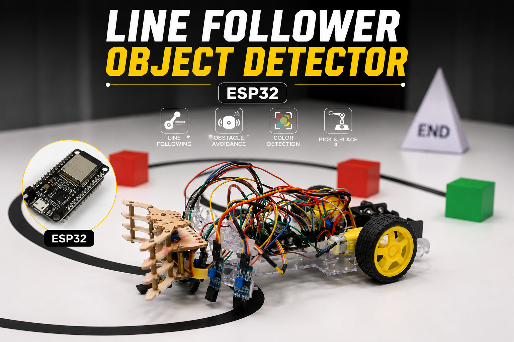

# ESP32 Autonomous Line Follower with Object Detection and Pick & Place

## Project Overview

This project is an ESP32-based autonomous mobile robot designed for line following, colored object detection, obstacle avoidance, and pick-and-place operation.

The robot follows a predefined path using a 6-sensor IR array and uses a TCS34725 RGB Color Sensor to identify colored obstacles and target objects. A servo-based gripper mechanism is used to pick, carry, and deposit objects autonomously.

The system demonstrates real-time embedded control, sensor integration, PID-based navigation, object handling, and autonomous robotic decision-making.

---

## Project Image



---

## Main Features

- Autonomous line following
- 6 IR sensor-based path detection
- Smooth PID-based motor control
- Colored object detection using TCS34725 RGB sensor
- Obstacle detection using IR sensor
- Pick, carry, and deposit sequence using servo gripper
- Fixed 45-degree left and right turn handling
- Motor speed ramping for smooth movement
- Lost-line recovery logic
- Real-time decision making using ESP32

---

## Hardware Components

| Component | Purpose |
|---|---|
| ESP32 DevKit | Main microcontroller |
| 6x IR Line Sensors | Detect line path |
| IR Obstacle Sensor | Detect obstacles |
| TCS34725 RGB Color Sensor | Detect colored objects |
| Servo Motor | Gripper control |
| Gripper Mechanism | Pick and place operation |
| L298N Motor Driver | Drive DC motors |
| 2x DC Geared Motors | Robot movement |
| Robot Chassis Kit | Mechanical structure |
| Battery Pack | Power supply |
| Jumper Wires | Electrical connections |

---

## Pin Configuration

### IR Sensors

| Sensor | ESP32 Pin |
|---|---|
| S1 | GPIO 34 |
| S1A | GPIO 16 |
| S2 | GPIO 35 |
| S3 | GPIO 32 |
| S2A | GPIO 17 |
| S4 | GPIO 23 |

### Obstacle Sensor

| Sensor | ESP32 Pin |
|---|---|
| OBS | GPIO 18 |

### Motor Driver

| Motor Driver Pin | ESP32 Pin |
|---|---|
| IN1 | GPIO 25 |
| IN2 | GPIO 26 |
| IN3 | GPIO 27 |
| IN4 | GPIO 14 |
| ENA | GPIO 33 |
| ENB | GPIO 19 |

---

## Control Algorithm

The robot uses PID-based line following for smooth navigation.

Sensor weight values:

| Sensor | Weight |
|---|---|
| S1 | -6 |
| S1A | -3 |
| S2 | -1 |
| S3 | +1 |
| S2A | +3 |
| S4 | +6 |

The correction is calculated using:

```cpp
correction = (Kp * error) + (Kd * derivative);
````

Used PID values:

```cpp
Kp = 11.0
Kd = 3.2
```

A smoothing filter is used to reduce sudden motor speed changes and improve stable movement.

---

## Color Detection System

The robot uses the TCS34725 RGB Color Sensor to detect colored obstacles and target objects.

The color sensor processes RGB values and classifies object colors for autonomous robotic decision making.

Applications:

* Colored obstacle identification
* Target object detection
* Autonomous object handling

---

## Pick and Place Mechanism

A servo-based gripper mechanism is used for object handling.

The robotic sequence includes:

1. Detect object
2. Pick object using gripper
3. Carry object along the path
4. Deposit object at target location

The servo motor controls the gripper opening and closing operation.

---

## Obstacle Avoidance Logic

When an obstacle is detected, the robot follows this sequence:

1. Stop
2. Move backward
3. Turn right strongly
4. Move in a wide arc
5. Move forward to bypass the obstacle
6. Turn left to return to the path
7. Search and reconnect to the line
8. Continue normal line following

---

## Special Turn Handling

The robot includes fixed 45-degree left and right turn logic.

After detecting a turn, the robot ignores the old line for a short time and then searches for the new center line using the middle sensors.

This improves stability during sharp turns and prevents incorrect turning behavior.

---

## Libraries Used

* ESP32Servo
* Adafruit_TCS34725
* Wire

---

## Software Used

* Arduino IDE
* Embedded C / C++
* ESP32 PWM Control
* Digital Sensor Reading
* PID Control Logic

---

## Applications

* Robotics education
* Autonomous mobile robots
* Smart object handling systems
* Embedded systems learning
* Industrial automation demonstrations

---

## Future Improvements

* Improve PID tuning
* Add OLED display for debugging
* Add wireless monitoring
* Improve object classification
* Add advanced path planning
* Implement AI-based navigation

---

## Project Type

Robotics and Automation Mini Project

```
```
